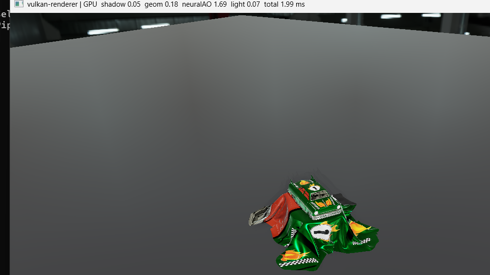

# vulkan-renderer

A real-time 3D renderer built from scratch with the **Vulkan** API in C++20 — no engine, no
abstraction layer hiding the driver. It implements a full deferred PBR pipeline, image-based
lighting, shadow mapping, multithreaded command recording, a hand-written GPU memory allocator,
and a **neural** (compute-shader MLP) ambient-occlusion pass.



> Built as a deep dive into the systems that underlie GPU drivers: explicit memory management,
> synchronization, queue submission, SPIR-V, and pipeline-cache serialization — plus an ML
> extension that runs a trained network inside the real-time pipeline.

## Highlights

- **Deferred renderer** — a four-target G-buffer geometry pass (position, normal+roughness,
  albedo+metallic, emissive+AO) feeding a fullscreen lighting pass.
- **Physically based shading** — GGX / Cook-Torrance BRDF, metallic-roughness materials with
  normal mapping, and **image-based lighting** (irradiance + prefiltered specular + BRDF LUT,
  all precomputed on the GPU with compute shaders).
- **Shadow mapping** — an offscreen depth pass from a directional light, sampled with 3×3 PCF.
- **Multithreaded recording** — draws are partitioned across a thread pool, each worker recording
  a **secondary command buffer** from its own command pool, executed by the primary.
- **Custom GPU allocator** — a hand-written `VkDeviceMemory` sub-allocator (aligned free-list over
  large heaps) that replaces the reference VMA library.
- **Neural ambient occlusion** — a small MLP, trained offline, runs **per-pixel in a compute
  shader** over the G-buffer to approximate AO.
- **Tooling** — `VkPipelineCache` serialized to disk for warm starts, and `VkQueryPool` GPU
  timestamps giving per-pass timings live in the window title.

Loads glTF models (tinygltf) and HDR environments (stb) fetched automatically at configure time.

## What you're seeing

A [ToyCar](https://github.com/KhronosGroup/glTF-Sample-Assets) glTF model spinning on a dark,
glossy floor in a workshop environment. The scene is deliberately dark: the environment lighting
is dimmed and the visible background darkened, so the car is shaped by a bright directional key
light while still catching the environment as reflections. Neural AO darkens the contact and
crease regions, and a directional shadow grounds the car. The title bar shows measured GPU time
per pass, e.g. `shadow 0.05  geom 0.18  neuralAO 1.7  light 0.07  total 2.0 ms`.

The scene is data-driven — point `ASSET_PATH` / `ENV_HDR_PATH` (in `CMakeLists.txt`) at any glTF
model and HDR environment to change it.

## Architecture

Each frame runs four GPU passes, with a compute pass for the neural AO in the middle:

```
shadow pass ──► geometry pass ──► neural-AO compute ──► lighting pass ──► present
(depth from     (writes the        (MLP over the         (fullscreen: reads
 the light)      G-buffer, MRT)     G-buffer -> AO)        G-buffer + shadow
                     ▲                                     + IBL + AO -> HDR
        recorded in parallel across                        -> tonemap)
        worker threads (secondary CBs)
```

Image-based-lighting maps (irradiance, prefiltered specular, BRDF LUT) are precomputed once at
startup via compute shaders. All GPU memory — vertex/index/uniform buffers, the G-buffer, shadow
maps, textures, and IBL images — is sub-allocated by the custom allocator.

```
src/
  core/    Window (GLFW), ThreadPool
  vk/      Instance, Device, Swapchain, Surface, DeviceAllocator, Buffer, Image
  render/  Renderer (the frame graph), GltfLoader, Ibl, Vertex
shaders/   gbuffer, lighting, shadow, ssao, ibl_* (GLSL -> SPIR-V via glslc)
tools/     train_ssao_mlp.py (offline MLP training)
assets/    ssao_mlp.bin (committed trained weights)
```

## How it was built

Developed as ten runnable milestones, each a self-contained step:

- **Phase 0** — toolchain, CMake skeleton, `VkInstance` smoke test
- **Phase 1** — swapchain + first triangle (render pass, pipeline, sync)
- **Phase 2** — custom allocator's reference (VMA), vertex/index/uniform buffers, depth, camera,
  textured glTF mesh
- **Phase 3** — PBR (GGX) + image-based lighting (compute-precomputed IBL, skybox)
- **Phase 4** — directional shadow mapping with PCF
- **Phase 5** — deferred rendering with a G-buffer
- **Phase 6** — multithreaded secondary command buffers
- **Phase 7** — hand-written `VkDeviceMemory` allocator (replaces VMA)
- **Phase 8** — pipeline-cache serialization + GPU timestamp profiling
- **Phase 9** — neural ambient occlusion (offline-trained MLP, GLSL compute inference)
- **Phase 10** — portfolio polish

## Build

Requires the [Vulkan SDK](https://vulkan.lunarg.com), CMake ≥ 3.24, and a C++20 compiler.
Third-party dependencies (GLFW, GLM, stb, tinygltf) and the sample glTF model + HDR environment are
fetched automatically by CMake.

```sh
cmake -S . -B build
cmake --build build --config Release
# Windows: build\bin\Release\vkrenderer.exe
# Linux:   build/bin/vkrenderer
```

The window is resizable; close it to exit. GPU memory is managed by the hand-written allocator
(Phase 7); VMA was the Phase 2 reference. The neural-AO weights (`assets/ssao_mlp.bin`) are
committed — to retrain them: `python tools/train_ssao_mlp.py` (requires NumPy).

## Performance

Measured with `VkQueryPool` timestamp queries (1024×576, RTX 4050 Laptop): **~1.5 ms GPU per
frame**, split across shadow / geometry / neural-AO / lighting passes and shown live in the title
bar. The custom allocator reports its footprint on exit (e.g. *6 blocks, 384 MB reserved*). Runs
validation-clean with the Khronos validation layers enabled in debug builds.

## Résumé entry

A ready-to-paste project description lives in [docs/RESUME_ENTRY.md](docs/RESUME_ENTRY.md).

## License

[MIT](LICENSE).
